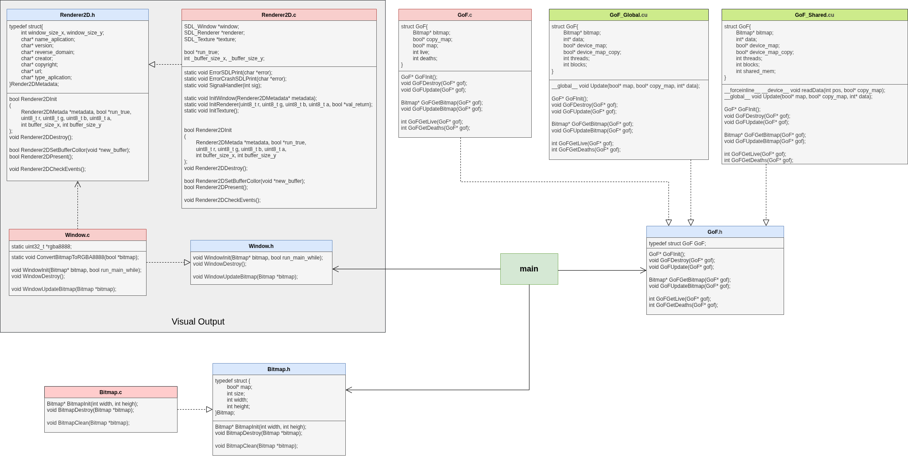
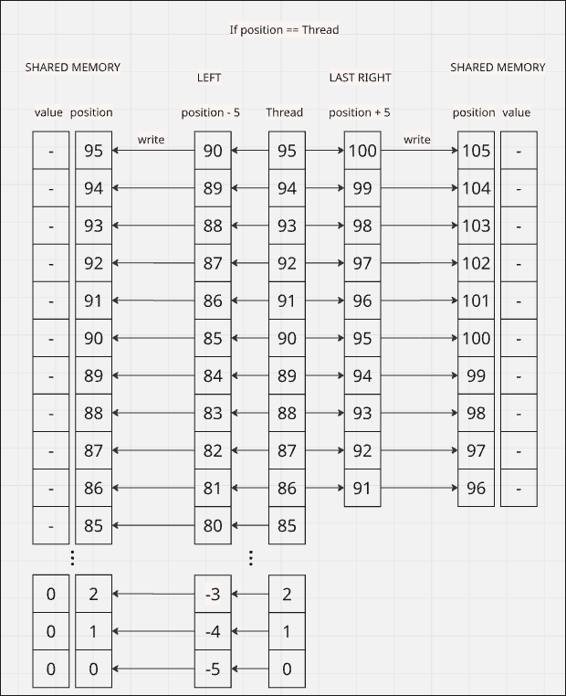
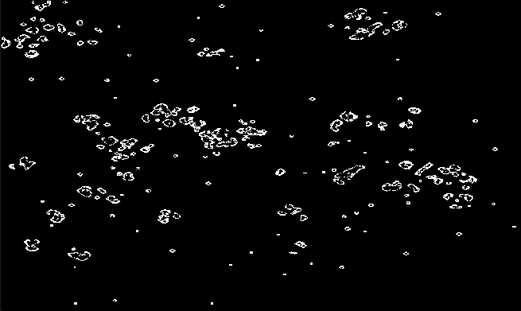

<h3><center>ΚΑΤΑΝΕΜΗΜΕΝΑ ΚΑΙ ΠΟΛΥΕΠΕΞΕΡΓΑΣΤΙΚΑ ΥΠΟΛΟΓΙΣΤΙΚΑ ΣΥΣΤΗΜΑΤΑ</center></h3>
<br/>
<h3><center>Σεπτέμβριος 2026</center></h3>
<h3><center>Υλοποίηση του παιχνιδιού Conway's Game of Life σε GPU/CUDA</center></h3>
<br/>
<h4><center>Γιούριϊ Οσιπιάν AM: Π22125</center></h4>
<br/>
<br/>

## Πίνακας Περιεχομένων
1. <a href="#εισαγωγή" style="text-decoration-line: underline; color: black;">Εισαγωγή</a>
2. <a href="#μεθοδολογία" style="text-decoration-line: underline; color: black;">Μεθοδολογία</a>
3. <a href="#δομή-εφαρμογής" style="text-decoration-line: underline; color: black;">Δομή Εφαρμογής</a>
4. <a href="#υλοποίηση-σε-cuda-χωρίς-shared-memory" style="text-decoration-line: underline; color: black;">Υλοποίηση σε cuda χωρίς shared memory</a>
5. <a href="#υλοποίηση-σε-cuda-με-shared-memory" style="text-decoration-line: underline; color: black;">Υλοποίηση σε cuda με shared memory</a>
6. <a href="#εκτέλεση" style="text-decoration-line: underline; color: black;">Εκτέλεση</a>
7. <a href="#στατιστικά" style="text-decoration-line: underline; color: black;">Στατιστικά </a>
8. <a href="#συμπεράσματα" style="text-decoration-line: underline; color: black;">Συμπεράσματα</a>


<div style="page-break-after: always;"></div>


## Εισαγωγή
---
Στην παρούσα εργασία θα γίνει επιτάχυνση του παιχνιδιού **Conway's Game Of Life** με χρήση nvidia GPU. Οι γλώσσες προγραμματισμού που χρησιμοποιήθηκαν είναι **C** και **CUDA**. Η C θα χρησιμοποιηθεί για τη σειριακή εκτέλεση και η CUDA στην παράλληλη εκτέλεση του Game Of Life.
### **Κανόνες παιχνιδιού**
To παιχνίδι αποτελείται από ένα σύμπαν (universe), ένα 2Δ πλέγμα κελιών, όπου κάθε κελί είναι σε κατάσταση:
alive ή dead. Σε κάθε γενιά (generation), ένα κελί «πεθαίνει», «επιζεί» ή «γεννιέται» ανάλογα με την κατάστασή
του και την κατάσταση των γειτονικών του κελιών
- Κάθε κελί αλληλεπιδρά με τα γειτονικά του σε μια ακτίνα 5 κελιών (οριζόντια, κάθετα & διαγώνια). Άρα το κελί βρίσκεται στο κέντρο ενός τετραγώνου διαστάσεων 11x11 (έχει 120 γείτονες).
- Ένα ζωντανό κελί με 34 έως 58 ζωντανούς γείτονες επιζεί.
- Ένα ζωντανό κελί πεθαίνει όταν έχει λιγότερους από 34 (λόγω μοναξιάς) και περισσότερους από 58 ζωντανούς γείτονες (λόγω υπερπληθυσμού).
- Ένα πεθαμένο κελί με 34 έως 45 ζωντανούς γείτονες γεννιέται (ως αναπαραγωγή)
### **Στόχος εργασίας**
Να φτιαχτούν 3 εκδόσεις της εφαρμογής. Μία σειριακή σε CPU και δύο παράληλες σε GPU. Η μία θα είναι χωρίς την χρήση της shared memory και η άλλη με χρήση της shared memory.
Αφού υλοποιηθούν, θα γίνει η σύγκριση των εκδώσεων

<div style="page-break-after: always;"></div>


## Μεθοδολογία
---

Υπάρχει πίνακας 1Δ για αναπαράσταση πλέγματος 2Δ με τιμές `true` `false`. Όπου η τιμή `true` αντιστοιχεί στο <<ζωντανό>> κελί και η τιμή `false` αντιστοιχεί στο <<πεθαμένο>>. Τώρα για να επιτυγχανθεί ο υπολογισμός της νέα γενιάς χωρίς να επηρροή της προηγοήμενη. Υπάρχει και άλλος ένας πίνακας αντίστοιχος όπως ο προηγούμενος. 

Επίσης υπάρχουν μετρητές των <<ζωντανών>> και <<πεθαμένων>> κελιών

### **Βήματα Αλγορίθμου**
1. Μέτρηση ζωντανών κελιών από τον έναν πίνακα (11x11 - 1 προσθέσεις)
2. Απόφαση αν το κελί <<επιζήσει>>, <<πεθάνει>> ή <<γεννηθεί>>
3. Ανάλογα με το αποτέλεσμα. Θα γίνει πρόσθεση στον κατάλληλο μετριτή
4. Αποθήκευση αποτελέσματος στον άλλον πίνακα
5. Επανάληψη

### **Προβλήματα Αλγορίθμου**
Το κύριο πρόβλημα του αλγορίθμου, συναντάται στο βήμα 1. Εκεί γίνεται πρόσθεση (11x11 - 1) κελιών για κάθε κελί στο σύμπαν. Σε μικρό σύμπαν μπορεί να μην είναι πολλές οι πράξεις, αλλά σε περίπτωση που το σύμπαν είναι μεγάλο. Απαιτείται πολύ μεγάλος αριθμός πράξεων πρόσθεσης. Για παράδειγμα, σύμπαν με πλέγμα κελιών 1000x1000. (11x11 - 1)x1000x1000=120.000.000 προσθέσεις ανά γενιά.

### **Λύσεις Προβλήματος**
Υπάρχει η δυνατότητα της σειριακής εκτέλεσης του αλγορίθμου. Όμως αυτό θα παρουσιάσει μεγάλο χρόνο εκτέλεσης

Υπάρχει η δυνατότητα της παραλληλοποίησης του αλγορίθμου με χρήση της GPU. Αν πάρουμε κάθε thread και το αντιστοιχίσουμε σε κάθε κελί στο σύμπαν. Μειώνεται σημαντικά ο χρόνος εκτέλεσης. Για παράδειγμα σύμπαντος με πλέγμα κελιών 1000x1000. Τα 1000x1000 κελιά θα υπολογίζονται παράλληλα, ενώ ο έλεγχος των 11x11 γειτόνων κάθε κελιού θα γίνεται σειριακά ανά thread.

Βήματα εκτέλεσης εφαρμογής σε GPU:
- Η CPU θα παράγει το σύμπαν (ένα 2Δ πλέγμα κελιών διαστάσεων ΜxΜ) αρχικοποιώντας ψευδοτυχαία την κατάσταση των κελιών.
- Η CPU θα αντιγράφει τον πίνακα στην μνήμη της GPU.
- Η GPU θα υπολογίζει την επόμενη γενιά και τον αριθμό των «ζωντανών» και «πεθαμένων» κελιών
- Η GPU θα στέλνει στην CPU τα αποτελέσματα (τους 2 μετρητές)
- H CPU θα απεικονίζει τα αποτελέσματα (μετρητές) στην οθόνη
- Η GPU θα στέλνει το νέο σύμπαν στην CPU και η CPU θα το απεικονίζει στην οθόνη
- Επανάληψη των βημάτων 3-6

<div style="page-break-after: always;"></div>

## Δομή Εφαρμογής
---

### **Configuration Files**
Μέσα στην εφαρμογή υπάρχουν αρχεία που προσφέρουν την δυνατότητα ρύθμισης της εφαρμογής. Τα αρχεία είναι `mainConfig.h` και `GoF_Calculation/GoFConfig.h`

### **Conway's Game of life Implementation Files**
- Σειριακός κώδικας σε CPU: `GoF_Calculation/GoF.c`
- Παράλληλος κώδικας σε GPU χωρίς shared memory: `GoF_Calculation/GoF_Global.cu`
- Παράλληλος κώδικας σε GPU με shared memory: `GoF_Calculation/GoF_Shared.cu`

### **Diagrams**
- Class Diagram: `doc/GameOfLife_Diagram.png` or `doc/GameOfLife_Diagram.drawio`



<div style="page-break-after: always;"></div>

## Υλοποίηση σε cuda χωρίς shared memory
---

### **Πριν την εκτέλεση του κύρου βρόχου**
1) Δεσμεύονται δύο πίνακες τιμών `bool` στην global memory της GPU μεγέθους του σύμπαντος 
2) Δεσμεύεται πίνακας δύο στοιχείων των `int` για τους μετρητές στην global memory της GPU
3) Διαβάζονται δεδομένα από την GPU ώστε να υπολογιστεί ο αριθμός των threads και blocks που θα χρησιμοποιήσει ο πυρήνας
    - threads = threads per multiprocessor / max blocks per multiprocessor
    - blocks = (μέγεθος του πλέγματος + threads - 1) / threads 
4) Αντιγραφή του πλέγματος από την CPU στον έναν πίνακα που δεσμεύτηκε στην GPU

### **Κύριος Βρόχος**
1) Ο πίνακας με τους μετρητές ορίζεται με τιμές 0 
2) Εκτέλεση του πυρήνα
3) Αντιγραφή δεδομένων από την GPU στην CPU
4) Αλλαγή των πινάκων μεταξύ τους

### **Πυρήνας**
Γίνεται αντιστοίχιση των threads 1-1 με τα κελιά. Αν περισσευθούν threads. Τότε αυτά θα μείνουν αδρανή. Αυτό μπορεί να γίνει αν το πρόβλημα δεν διαιρείται τέλεια με το 32 (ένα warp έχει 32 threads).


#### global memory:
Η υλοποίηση του ακολουθειακού μέρος του κώδικα γίνεται μέσο δύο βρόχων (είναι η πρόσθεση τιμών τον γειτονικών κελιών). Ο εξωτερικός αντιστοιχεί στις γραμμές (οριζόντια σειρά) και ο εσωτερικός στις στήλες (κάθετη σειρά). Αυτές οι τιμές θα μετατραπούν στις θέσεις μνήμης του 1Δ πίνακα (ο 1Δ πίνακας αναπαρηστά το πλέγμα)

Γνωρίζοντας ότι κάθε read/write στην global memory είναι σε σειρά 32 byte. Ο εσωτερικός βρόγχος επιλέγχθηκε εσκεμένα να αντιπροσωπεύει τις στήλες. Με αυτό τον τρόπο επιτυγχάνεται καλύτερο memory coalescing, διότι συνεχόμενα threads διαβάζουνε συνεχόμενες θέσεις στην μνήμη

#### μετρητές:
Πρόσθεση στον κατάληλο μετριτή χωρίς να κλειδώνεται η θέση μνήμης, μπορεί να φέρει σε απρόβλεπτα σενάρια. Για παράδειγμα thread_1 και thread_2 διάβασαν 2 ζωντανά κελιά από τον μετρητή και εκτέλεσαν πρόσθεση. Με αυτό τον τρόπο ανεξάρτητα από την σειρά. Το τελικό αποτέλεσμα που θα γραφτεί είναι 3 και όχι 4. Με τα atomic operations δεν θα υπάρχει αυτό το πρόβλημα, εφόσον κληδώνουν την θέση μνήμης όταν γίνεται read-write 


### **Μετά της εκτέλεσης του κύριου βρόχου**
Απελευθερώνεται η μνήμη που είχε δεσμευτεί στην GPU

<div style="page-break-after: always;"></div>


## Υλοποίηση σε cuda με shared memory
---

### **Πριν την εκτέλεση του κύριου**
Τα βήματα είναι παρόμοια με την <a href="#υλοποίηση-σε-cuda-χωρίς-shared-memory" style="text-decoration-line: underline; color: black;">Υλοποίηση σε cuda χωρίς shared memory</a> με την διαφορά ότι υπάρχει ένα παραπάνω βήμα

6) Διαβάζονται δεδομένα από την GPU ώστε να υπολογιστεί σωστά το μέγεθος της dynamic shared memory που θα χρειαστεί κάθε block. θα πρέπει να δεσμευτεί
    - shared memory = threads per block + (radius * 2)

Σημείωση: Θα εξηγηθεί στον πυρήνα ο λόγος αυτού του μεγέθους της shared memory

### **Κύριος Βρόχος**
Όμοια με την <a href="#υλοποίηση-σε-cuda-χωρίς-shared-memory" style="text-decoration-line: underline; color: black;">Υλοποίηση σε cuda χωρίς shared memory</a>

### **Πυρήνας**
Όπως και στην <a href="#υλοποίηση-σε-cuda-χωρίς-shared-memory" style="text-decoration-line: underline; color: black;">Υλοποίηση σε cuda χωρίς shared memory</a> γίνεται αντιστοίχιση των threads και χρήση atomic operations. Αλλά στην Υλοποίηση με shared memory χρειάζεται πιο αυστηρό έλεγχο της μνήμης

#### shared memory
Στον εξωτερικός βρόχο (οριζόντια σειρά - γραμμή) γίνεται ανάγνωση της γραμμής (threads per block + (radius * 2)) δεδομένων για κάθε block ξεχωριστά, από την global memory στην shared memory. Κάθε thread διαβάζει την αριστερότερη τιμή που χρειάζεται (στην γραμμή που είναι) για τον υπολογισμό των γειτόνων, από την global memory και την εγραφή στην shared memory. Με αυτό τον τρόπο κάθε thread έχει όλα τα δεδομένα για να κάνει την πρόσθεση εκτός των τελευταίων thread. Για αυτό τον λόγο τα τελευταία (radius * 2) threads διαβάζουν και τα δεξιότερα δεδομένα. Έτσι όλα τα απαραίτητα δεδομένα της συγκεκριμένης γραμμής έχουν μεταφερθεί στη shared memory πριν την αρχή του υπολογισμού της.

Αφού μεταφερθούν τα δεδομένα και γίνει συγχρονισμός (πρέπει να προλάβουν τα threads να μεταφέρουν τα δεδομένα πριν τον πρόσθεση). Μπορεί να αρχίσει ο δεύτερος βρόχος τις προσθέσεις. Τέλος πριν γίνει επανάληψη του εξωτερικού βρόχου Θα χρειαστεί να γίνει συγχρονισμός (δεν πρέπει ο επόμενος κύκλος να γράψει κάτι στην shared memory πριν γίνει η μέτρηση από τον προηγούμενο)

Αυτή η υλοποίησει βοηθάει να μιωθούν οι προσπελάσεις που πρέπει να γίνουν στην μνήμη. Επίσης επειδή τα δεδομένα όπως και τα threads είναι σε σειρά, άρα γίνετε καλύτερο memory coalescing  

Εδώ είναι ένα παράδειγμα όπου radius = 5, έχουν δεσμεφτεί 96 threads ανά block και η σειρά είναι 0 (η μέτρηση είναι από -5 έως 5)

<center>  </center>


### **Μετά της εκτέλεσης του κύριου βρόχου**
Όμοια με την <a href="#υλοποίηση-σε-cuda-χωρίς-shared-memory" style="text-decoration-line: underline; color: black;">Υλοποίηση σε cuda χωρίς shared memory</a>


<div style="page-break-after: always;"></div>


## Εκτέλεση
---

### **Εκτέλεση με Makefile**
Για την κατασκευή και την εκτέλεση της εφαρμογής έχει φτιαχτεί makefile

#### Μεταγλώττιση

- `make build_cpu` για την σειριακή εκτέλεση στην CPU
- `make build_gpu_global` για την παράλληλη εκτέλεση στην GPU
- `make build_gpu_shared` για την παράλληλη εκτέλεση στην GPU με χρήση της shared memory

Σε περίπτωση απενεργοποίησης της SDL3 βιβλιοθήκης. Υπάρχει το flag `USE_SDL=0`. Παράδειγμα χρήσης `make build_cpu USE_SDL=0`

#### Εκτέλεση

Σημείωση: πρώτα πρέπει να γίνει η μεταγλώττιση και μετά το run

- `make run_cpu` εκτέλεση της σειριακής έκδοσης στην CPU
- `make run_gpu_global` εκτέλεση της παράλληλης έκδοσης στην GPU
- `make run_gpu_shared` εκτέλεση της παράλληλης έκδοσης με shared memory στην GPU

### **Εκτέλεση χωρίς Makefile**

#### Μεταγλώττιση

##### Χωρίς SDL3
- CPU:: `gcc main.c utils/Bitmap.c GoF_Calculation/GoF.c -o build/test_cpu -D NO_SDL`
- GPU Global:: `nvcc main.c utils/Bitmap.c GoF_Calculation/GoF_Global.cu -o build/test_gpu_global -D NO_SDL`
- GPU Shared:: `nvcc main.c utils/Bitmap.c GoF_Calculation/GoF_Shared.cu -o build/test_gpu_shared -D NO_SDL`

##### Με SDL3
- CPU:: `gcc main.c utils/Bitmap.c GoF_Calculation/GoF.c GoF_Window/Renderer2D.c GoF_Window/Window.c -o build/test_cpu -lSDL3`
- GPU Global:: `nvcc main.c utils/Bitmap.c GoF_Calculation/GoF_Global.cu GoF_Window/Renderer2D.c GoF_Window/Window.c -o build/test_gpu_global -lSDL3`
- GPU Shared:: `nvcc main.c utils/Bitmap.c GoF_Calculation/GoF_Shared.cu GoF_Window/Renderer2D.c GoF_Window/Window.c -o build/test_gpu_shared -lSDL3`

#### Εκτέλεση

Σημείωση: πρώτα πρέπει να γίνει η μεταγλώττιση και μετά το run

Τα αρχεία που θα παραχθούν από την μεταγλώττιση. Τώρα είναι έτοιμα για εκτέλεση
- CPU:: `./build/test_cpu`
- GPU Global:: `./build/test_gpu_global`
- GPU Shared:: `./build/test_gpu_shared`


### **SDL3**
Η χρήση της βιβλιοθήκης SDL3 επιτρέπει την οπτικοποίηση του Game of Life σε πραγματικό χρόνο μέσω παραθύρου

παράδειγμα:

<center>  </center>


<div style="page-break-after: always;"></div>


## Στατιστικά
---

### **Hardware**
```bash
GPU Characteristics:
	Max SM::16
	Max Threads per SM::1536
	Max Registers per SM::65536
	Max Shared memory per SM::102400
	---
	Max Blocks per SM::16
	Max Threads per Block::1024
	Max Registers per Block::65536
	Max Shared memory per Block::49152
```

### **Τρόπος μέτρησης στατιστικών**
Θα οριστεί μέγιστος αριθμός N γενεών. Μετά τον τερματισμό της εφαρμογής θα παρουσιαστούν τα αποτελέσματα(χρόνος εκτέλεσης και μέσος χρόνος εκτέλεσης). Τα αποτελέσματα είναι αυστηρά ο χρόνος εκτέλεσης της εύρεσης της επόμενης γενιάς και η μεταφορά απαρέτητων δεδομένων τους.

Θα γίνει μέτρηση στατιστικών με χρήση της SDL3 βιβλιοθήκης και χωρίς. Ο λόγος κρύβεται στον σχεδιασμό της ίδια της βιβλιοθήκης. Η SDL3 επηρεάζει τον συνολικό χρόνο εκτέλεσης λόγω rendering, event handling και synchronization με το παράθυρο εμφάνισης, με αποτέλεσμα οι μετρήσεις να μην αντικατοπτρίζουν αποκλειστικά τον χρόνο εκτέλεσης του αλγορίθμου

Σημείωση: Η μεταφορά του πίνακα (το σύμπαν) θα γίνει ανεξάρτητα από το αν γίνετε χρήση της SDL3. Άρα θα υπάρχει μια αρνητική επιρροή χρόνου λόγω μεταφοράς δεδομένων

#### Χωρίς την SDL3
Ο μέγιστος αριθμός γενεών είναι **500**

##### Χρόνος εκτέλεσης
|Μέγεθος πλέγματος| CPU | GPU Global | GPU Shared |
|-|-|-|-|
|512x512| 47.289 (sec) | 164.258 (ms) | 138.834 (ms) |
|1024x1024| 189.398 (sec) | 524.254 (ms) | 452.014 (ms) |
|2048x2048| Ν/Α | 1.761 (sec) | 1.472 (sec) |
|4096x4096| Ν/Α | 6.701 (sec) | 5.577 (sec) |

<div style="page-break-after: always;"></div>

##### Μέσος όρος (Χρόνος ανά γενιά)
|Μέγεθος πλέγματος| CPU | GPU Global | GPU Shared |
|-|-|-|-|
|512x512| 94.58 (ms) | 0.329 (ms) | 0.278 (ms) |
|1024x1024| 378.797 (ms) | 1.049 (ms) | 0.904 (ms) |
|2048x2048| Ν/Α | 3.522 (ms) | 2.945 (ms) |
|4096x4096| Ν/Α | 13.403 (ms) | 11.156 (ms) |


##### Επιτάχυνση
|Μέγεθος πλέγματος| CPU | GPU Global | GPU Shared |
|-|-|-|-|
|512x512| 1 | ~287.89 | ~349.61 |
|1024x1024| 1 | ~361.10 | ~419.02 |
|2048x2048| Ν/Α | 1 | ~1.19 |
|4096x4096| Ν/Α | 1 | ~1.20 |

#### Με την SDL3
Ο μέγιστος αριθμός γενεών είναι **100** (Η μείωση του πλήθους γενεών αφορά αποκλειστικά το κόστος οπτικοποίησης και όχι την υπολογιστική απόδοση του αλγορίθμου)

##### Χρόνος εκτέλεσης
|Μέγεθος πλέγματος| CPU | GPU Global | GPU Shared |
|-|-|-|-|
|512x512| 9.295 (sec) | 39.678 (ms) | 38.184 (ms) |
|1024x1024| 37.732 (sec) | 132.261 (ms) | 107.277 (ms) |
|2048x2048| N/A | 426.839 (ms) | 357.991 (ms) |
|4096x4096| N/A | 1.570 (sec) | 1.378 (sec) |

##### Μέσος όρος (Χρόνος ανά γενιά)
|Μέγεθος πλέγματος| CPU | GPU Global | GPU Shared |
|-|-|-|-|
|512x512| 92.953 (ms) | 0.396 (ms) | 0.382 (ms) |
|1024x1024| 377.32 (ms) | 1.323 (ms) | 1.073 (ms) |
|2048x2048| N/A | 4.268 (ms) | 3.58 (ms) |
|4096x4096| N/A | 15.706 (ms) | 13.789 (ms) |

##### Επιτάχυνση
|Μέγεθος πλέγματος| CPU | GPU Global | GPU Shared |
|-|-|-|-|
|512x512| 1 | ~234.72 | ~243.42 |
|1024x1024| 1 | ~285.28 | ~351.72 |
|2048x2048| Ν/Α | 1 | ~1.19 |
|4096x4096| Ν/Α | 1 | ~1.13 |

<br/>
<br/>

## Συμπεράσματα
---

Στην εργασία πραγματοποιήθηκε υλοποίηση του Conway’s Game of Life σε σειριακή έκδοση στην CPU και σε δύο παράλληλες εκδόσεις στην GPU με χρήση CUDA. 

Φαίνεται ξεκάθαρα από τα αποτελέσματα η μεγάλη επιτάχυνση της GPU σε σχέση με την CPU, καθώς το πρόβλημα μπορεί να παραλληλοποιηθεί αποδοτικά μέσω χιλιάδων threads. Επίσης όσο αυξάνεται το μέγεθος του πλέγματος, τόσο μεγαλύτερο γίνεται το πλεονέκτημα της GPU απέναντι στην CPU

Η υλοποίηση με χρήση shared memory παρουσίασε καλύτερη απόδοση από την υλοποίηση χωρίς, λόγω της μείωσης των προσπελάσεων στην global memory. Παρόλα αυτά, η διαφορά δεν ήταν πολύ μεγάλη, καθώς και η έκδοση "χωρίς shared memory" αξιοποιεί αποτελεσματικά την cache memory της GPU

Τέλος, σε αυτή την εργασία έγινε προσπάθεια επιτάχυνσης του Conway's Game Of Life. Παρόλα αυτά, υπάρχουν αρκετές ακόμη τεχνικές βελτιστοποίησης που δεν υλοποιήθηκαν στην παρούσα εργασία.